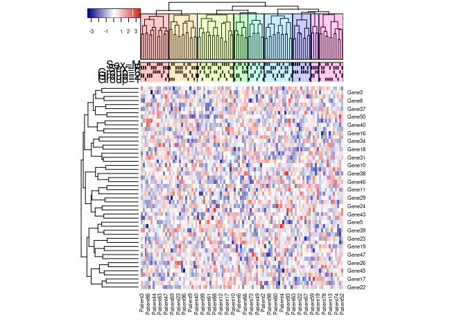

Heatmap_Statistics
================
Louis El Khoury, PhD
2025-01-26

## Heatmap Statistics

Often one faces a situation where they have a heatmap and they wonder if
there is a statistical difference in the distribution of the different
datapoints across the dendrogram and heirachical clustering. To
clalculate any distribution difference we are going to use the
*heatmap3* package in R.

``` r
# Load the required libraries
# install.packages("heatmap3")
library(heatmap3)
library(RColorBrewer)
```

``` r
# Create a matrix of random numbers
set.seed(123)
col_n <- 100
row_n <- 50
data <- matrix(rnorm(col_n * row_n), nrow = row_n, ncol = col_n)

# column names are patient numbers
colnames(data) <- paste0("Patient", 1:col_n)

# row names are gene names
rownames(data) <- paste0("Gene", 1:row_n)
```

``` r
# Examining the data matrix
data[1:5, 1:5]
```

    ##          Patient1    Patient2   Patient3   Patient4   Patient5
    ## Gene1 -0.56047565  0.25331851 -0.7104066  0.7877388  2.1988103
    ## Gene2 -0.23017749 -0.02854676  0.2568837  0.7690422  1.3124130
    ## Gene3  1.55870831 -0.04287046 -0.2466919  0.3322026 -0.2651451
    ## Gene4  0.07050839  1.36860228 -0.3475426 -1.0083766  0.5431941
    ## Gene5  0.12928774 -0.22577099 -0.9516186 -0.1194526 -0.4143399

``` r
# Create pheno file with groups patients are randomly assigned to
pheno <- data.frame(Patient = colnames(data), Group = sample(1:3, col_n, replace = TRUE))
# add a column specifying sex
pheno$Sex <- sample(c("M", "F"), col_n, replace = TRUE)
```

``` r
# Examining the pheno file
head(pheno)
```

    ##    Patient Group Sex
    ## 1 Patient1     3   F
    ## 2 Patient2     1   F
    ## 3 Patient3     2   F
    ## 4 Patient4     2   F
    ## 5 Patient5     3   F
    ## 6 Patient6     2   M

``` r
# Creating colour vectors for the heatmap based on the content of pheno data
group_color_options <- c(brewer.pal(3, "Set2")) #assigning three different colours to the three different groups
groupCol <- NULL
for(i in 1:length(as.character(unique(pheno$Group)))){
  ind <- grep(paste("^", names(table(as.character(pheno$Group)))[i], "$", sep=""), pheno$Group)
  groupCol[ind] <- group_color_options[i]
}

sex_color_options <- c(brewer.pal(2, "Set3")) #assigning two different colours to the two sexes
```

    ## Warning in brewer.pal(2, "Set3"): minimal value for n is 3, returning requested palette with 3 different levels

``` r
sexCol <- NULL
for(i in 1:length(as.character(unique(pheno$Sex)))){
  ind <- grep(names(table(as.character(pheno$Sex)))[i], pheno$Sex)
  sexCol[ind] <- sex_color_options[i]
}

# binding columns together and calling them myCols
myCols <- cbind(groupCol, 
                sexCol) 
```

``` r
# plotting the heatmaps
heatmap3(data,
         cexRow=1.5, 
         cexCol=1.5, 
         ColSideColors=myCols,
         labRow = F, 
         labCol = F, 
         ColSideWidth = 0.2)
```

<!-- -->

We can see here that the patient group and sex are fairly distributed
along the column dendrogram but we do not have numerical information
about the distribution. To obtain this data we need to rerun
`heatmap3()` function but this time using the `ColSideCut`, `ColSideAnn`
and `ColSideFun` arguments. We will also need to create another pheno
data frame specific for the 2nd heatmap.

``` r
# Create a new data frame for the heatmap
phenoHeat <- data.frame(Group = as.factor(as.character(pheno$Group)), 
                        Sex = as.factor(as.character(pheno$Sex)))
rownames(phenoHeat) <- rownames(pheno)
```

``` r
# plotting another heatmap but this time we are assigning it to an object called results
result<-heatmap3(data,
                 ColSideCut=1.35,
                 ColSideAnn=phenoHeat,
                 ColSideFun=function(x) showAnn(x),
                 verbose=TRUE)
```

    ## The samples could be cut into 4 parts with height 1.35

    ## Warning in chisq.test(cutTable[[i]]): Chi-squared approximation may be
    ## incorrect

    ## Differential distribution for Group, p value by chi-squared test: 0.508
    ## Differential distribution for Sex, p value by chi-squared test: 0.506

<!-- -->

We can see now that the dendrogram has been split into different groups
based on the height of the `ColSideCut` parameter. To obtain the
distribution and the p-values for the $\chi$-squared test we can use the
following code:

``` r
result$cutTable
```

    ## $Group
    ##           Cluster 1 Cluster 2 Cluster 3 Cluster 4    pValue
    ## 1              7.00      9.00      2.00      8.00 0.5084643
    ## 2             11.00     12.00      6.00      4.00        NA
    ## 3             10.00     12.00      6.00     13.00        NA
    ## 1_Percent      0.25      0.27      0.14      0.32        NA
    ## 
    ## $Sex
    ##           Cluster 1 Cluster 2 Cluster 3 Cluster 4    pValue
    ## F             18.00     16.00      6.00     14.00 0.5055292
    ## M             10.00     17.00      8.00     11.00        NA
    ## F_Percent      0.64      0.48      0.43      0.56        NA

If you are not satisfied with the height of the cut you can change the
`ColSideCut` parameter and rerun the `heatmap3()` function. For example
you can raise the number for fewer groups, or drop it for more groups.
as shown below:

``` r
result2 <- heatmap3(data,
                    ColSideCut=1.25,
                    ColSideAnn=phenoHeat,
                    ColSideFun=function(x) showAnn(x),
                    verbose=TRUE)
```

    ## The samples could be cut into 9 parts with height 1.25

    ## Warning in chisq.test(cutTable[[i]]): Chi-squared approximation may be
    ## incorrect

    ## Differential distribution for Group, p value by chi-squared test: 0.419

    ## Warning in chisq.test(cutTable[[i]]): Chi-squared approximation may be
    ## incorrect

    ## Differential distribution for Sex, p value by chi-squared test: 0.488

<!-- -->

``` r
result2$cutTable
```

    ## $Group
    ##           Cluster 1 Cluster 2 Cluster 3 Cluster 4 Cluster 5 Cluster 6 Cluster 7
    ## 1              2.00      5.00      4.00      2.00      3.00      2.00      2.00
    ## 2              7.00      4.00      7.00      2.00      3.00      6.00      0.00
    ## 3              5.00      5.00      7.00      3.00      2.00      6.00      7.00
    ## 1_Percent      0.14      0.36      0.22      0.29      0.38      0.14      0.22
    ##           Cluster 8 Cluster 9    pValue
    ## 1                 0       6.0 0.4188586
    ## 2                 2       2.0        NA
    ## 3                 2       4.0        NA
    ## 1_Percent         0       0.5        NA
    ## 
    ## $Sex
    ##           Cluster 1 Cluster 2 Cluster 3 Cluster 4 Cluster 5 Cluster 6 Cluster 7
    ## F              9.00      9.00       9.0      3.00       4.0      6.00      3.00
    ## M              5.00      5.00       9.0      4.00       4.0      8.00      6.00
    ## F_Percent      0.64      0.64       0.5      0.43       0.5      0.43      0.33
    ##           Cluster 8 Cluster 9    pValue
    ## F                 4      7.00 0.4883939
    ## M                 0      5.00        NA
    ## F_Percent         1      0.58        NA

**NOTE:** The default clustering in *heatmap3()* is the complete linkage
clustering. You can change this by using the `distfun` argument. For
example, you can use `distfun = dist`.

``` r
sessionInfo()
```

    ## R version 4.4.0 (2024-04-24)
    ## Platform: x86_64-pc-linux-gnu
    ## Running under: Red Hat Enterprise Linux 8.10 (Ootpa)
    ## 
    ## Matrix products: default
    ## BLAS/LAPACK: /usr/lib64/libopenblasp-r0.3.15.so;  LAPACK version 3.9.0
    ## 
    ## locale:
    ##  [1] LC_CTYPE=en_US.UTF-8       LC_NUMERIC=C              
    ##  [3] LC_TIME=en_US.UTF-8        LC_COLLATE=en_US.UTF-8    
    ##  [5] LC_MONETARY=en_US.UTF-8    LC_MESSAGES=en_US.UTF-8   
    ##  [7] LC_PAPER=en_US.UTF-8       LC_NAME=C                 
    ##  [9] LC_ADDRESS=C               LC_TELEPHONE=C            
    ## [11] LC_MEASUREMENT=en_US.UTF-8 LC_IDENTIFICATION=C       
    ## 
    ## time zone: America/Chicago
    ## tzcode source: system (glibc)
    ## 
    ## attached base packages:
    ## [1] stats     graphics  grDevices utils     datasets  methods   base     
    ## 
    ## other attached packages:
    ## [1] RColorBrewer_1.1-3 heatmap3_1.1.9    
    ## 
    ## loaded via a namespace (and not attached):
    ##  [1] compiler_4.4.0    fastmap_1.2.0     cli_3.6.3         tools_4.4.0      
    ##  [5] htmltools_0.5.8.1 rstudioapi_0.16.0 yaml_2.3.10       rmarkdown_2.29   
    ##  [9] knitr_1.49        fastcluster_1.2.6 xfun_0.49         digest_0.6.37    
    ## [13] rlang_1.1.4       evaluate_1.0.1
